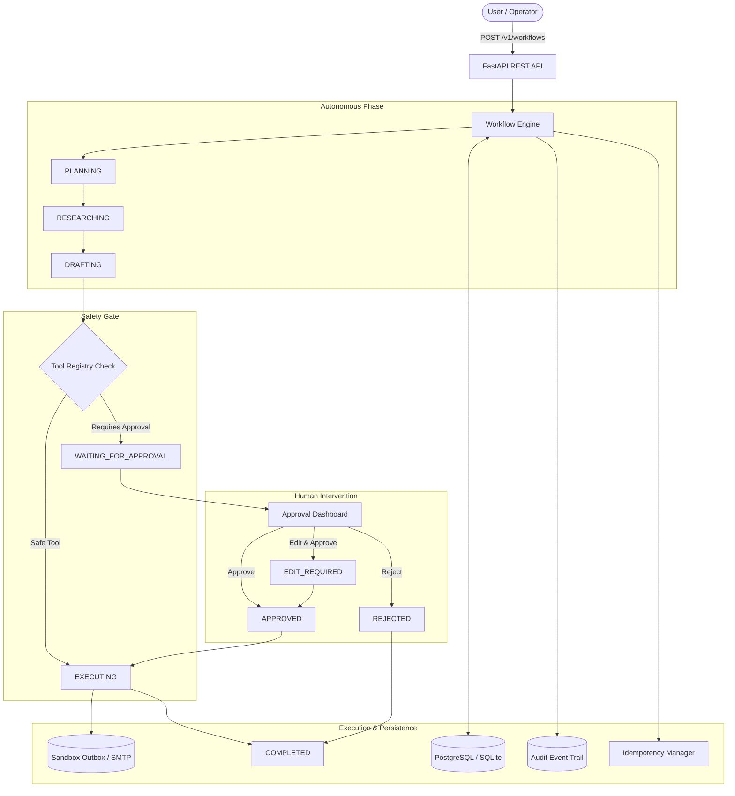
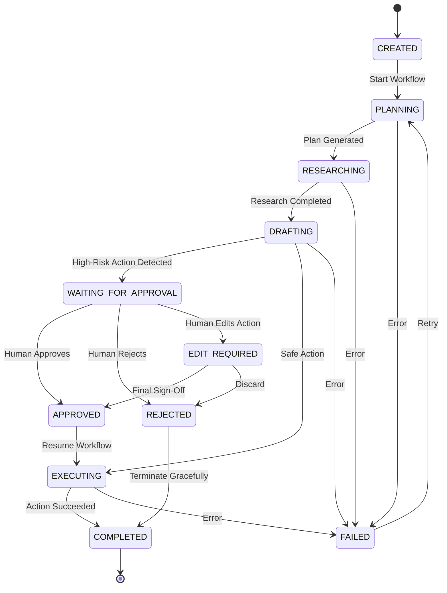

# ApprovalFlow Agent: Human-in-the-Loop AI Workflow System

[](https://github.com/approvalflow/approvalflow-agent/actions/workflows/ci.yml)
[](https://www.python.org/)
[](https://fastapi.tiangolo.com/)
[](https://opensource.org/licenses/MIT)

**ApprovalFlow Agent** is a production-grade Human-in-the-Loop (HITL) autonomous AI workflow system. It demonstrates how AI agents can perform multi-step planning, web intelligence gathering, and draft generation while **keeping humans strictly in control of consequential external actions**.

Unlike naive autonomous agents that loop blindly or bury approval instructions inside LLM prompts, ApprovalFlow implements an **explicit, database-backed state machine**, a **tool safety registry**, a **hard approval gate**, **deterministic idempotency protection**, and an **event-sourced audit trail**.

---

## Table of Contents
- [Problem](#problem)
- [Why Human Approval Matters](#why-human-approval-matters)
- [Example Workflow](#example-workflow)
- [Architecture](#architecture)
- [State Machine](#state-machine)
- [Risk Classification](#risk-classification)
- [Approval Model](#approval-model)
- [Audit Trail](#audit-trail)
- [Idempotency](#idempotency)
- [API Reference](#api)
- [Approval UI](#ui)
- [Local Setup](#local-setup)
- [Docker Deployment](#docker)
- [Testing](#testing)
- [Security](#security)
- [Limitations](#limitations)
- [Future Improvements](#future-improvements)

---

## Problem

Autonomous AI agents are capable of synthesizing vast amounts of data and executing multi-step tasks. However, in enterprise environments, granting an LLM direct, unmonitored access to external interfaces (e.g. sending emails to clients, transferring money, modifying production databases, or publishing public content) introduces catastrophic risks:
1. **Hallucinations & Inaccurate Tone**: Sending incorrect or brand-damaging communications to external stakeholders.
2. **Prompt Injections**: Malicious content encountered during web research can hijack the model's intent.
3. **Runaway Loops**: Bugs or edge cases leading to repeated, irreversible external actions.
4. **Lack of Compliance**: Inability to prove who authorized an action and what evidence was used.

---

## Why Human Approval Matters

True enterprise agent systems cannot be fully autonomous when executing high-impact side effects. **Human-in-the-loop is not a limitation; it is a critical architectural pattern:**

- **Humans maintain accountability** for irreversible real-world decisions.
- **Agents handle cognitive labor**: researching, summarizing, and formulating proposals.
- **Hard checkpoints guarantee safety**: Execution halts mechanically at the code level, not through easily bypassed LLM prompt instructions.

---

## Example Workflow

Consider the prompt:
> *"Research Acme Corp and prepare an outreach email."*

```
1. Interpret Task       ──> Identify company and goals
2. Autonomous Research  ──> Query company directory, identify leadership & pain points
3. Synthesize Findings  ──> Extract structured profile & key outreach angles
4. Formulate Proposal   ──> Draft personalized outreach email (recipient, subject, body)
5. Action Risk Check    ──> Registry identifies 'send_email' as REQUIRES_APPROVAL
6. APPROVAL GATE        ──> Workflow pauses & state is persisted to database
7. Human Decision       ──> Reviewer inspects proposal, edits copy, and approves
8. Resume from State    ──> Workflow resumes without re-running research
9. Idempotent Execution ──> Email dispatched to sandbox outbox with unique key
10. Final Observation   ──> Execution receipt logged; workflow marked COMPLETED
```

---

## Architecture



---

## State Machine

The system enforces strict, deterministic state transitions. Any illegal transition is rejected with `InvalidStateTransitionError`.



---

## Risk Classification

Safety policies are defined explicitly in code via the `ToolRegistry`, **never inside prompt templates**:

| Tool Name | Description | Risk Level | Requires Approval |
|---|---|---|---|
| `search_company_web` | Queries company profile, leadership, and news | `SAFE` | **No** |
| `extract_company_profile` | Synthesizes raw research into structured insights | `SAFE` | **No** |
| `send_email` | Dispatches external outreach communication | `REQUIRES_APPROVAL` | **YES** |
| `delete_record` | Removes database records *(extensible)* | `REQUIRES_APPROVAL` | **YES** |

---

## Approval Model

When an action requires approval, the workflow pauses and creates an `ApprovalRequest` record containing:
- **Proposed Action**: Exact tool name and JSON parameters.
- **Reasoning**: Why the agent chose this action.
- **Evidence**: Findings and citations collected during the research phase.
- **Consequences**: What will happen once approved (e.g. irreversible message delivery).
- **Risk Level**: Classification badge (`REQUIRES_APPROVAL` / `HIGH`).

### Reviewer Decisions:
1. **Approve**: Resumes execution directly from the checkpoint without re-running prior steps.
2. **Reject**: Records reviewer identity, timestamp, and mandatory rejection reason. Workflow terminates gracefully.
3. **Edit**: Human modifies parameters (recipient, subject, body). Both the original proposal and the edited version are preserved in the audit log.

---

## Audit Trail

Every meaningful lifecycle event is stored in an append-only `audit_events` table:

```json
{
  "event_id": "9b1deb4d-3b7d-4bad-9bdd-2b0d7b3dcb6d",
  "workflow_id": "2a5910f3-75a5-4fb5-b9e7-0c4738e711e1",
  "actor": "human:vp_engineering",
  "event_type": "action_edited",
  "from_state": "WAITING_FOR_APPROVAL",
  "to_state": "EDIT_REQUIRED",
  "timestamp": "2026-09-19T09:29:46.904Z",
  "metadata": {
    "original_action": { "recipient": "sarah.chen@acme.com" },
    "edited_action": { "recipient": "sarah.chen.custom@acme.com" },
    "reason": "Refined recipient and tailored technical pitch"
  }
}
```

---

## Idempotency

To prevent accidental duplicate execution of external actions upon approval retries, network timeouts, or UI double-clicks:
1. A deterministic key is derived: `wf-{workflow_id}-act-{hash}`.
2. The database enforces a `UNIQUE` constraint on `outbox_messages.idempotency_key`.
3. If an action is submitted again with the same key, the existing receipt is returned immediately with `status: ALREADY_SENT`, preventing duplicate external side effects.

---

## API

### Workflows
- `POST /v1/workflows`: Create and advance workflow to first checkpoint.
- `GET /v1/workflows`: List workflows (supports `?state=` filter).
- `GET /v1/workflows/{id}`: Retrieve workflow details, state, and intermediate data.
- `GET /v1/workflows/{id}/events`: Retrieve complete chronological audit trail.

### Approvals
- `GET /v1/approvals`: List pending approvals (`?status=PENDING`).
- `GET /v1/approvals/{id}`: Retrieve approval context and evidence.
- `POST /v1/approvals/{id}/approve`: Approve action and resume execution.
- `POST /v1/approvals/{id}/reject`: Reject action with mandatory reason.
- `POST /v1/approvals/{id}/edit`: Edit action parameters and execute.

### Sandbox & Health
- `GET /v1/outbox`: Inspect test sandbox messages dispatched by the agent.
- `GET /health`: System health and database connectivity status.

---

## UI

ApprovalFlow includes a responsive dashboard served directly from the FastAPI application at `http://localhost:8001/`.

- **Pending Approvals Cards**: Displays pending actions with risk badges, reasoning, evidence, and consequences.
- **Action Modals**: Native HTML5 `<dialog>` modals for editing parameters or entering rejection reasons.
- **All Workflows Table**: Real-time state badges across all workflows.
- **Audit Trail Inspector**: Chronological event timeline showing actors and state transitions.
- **Sandbox Outbox**: Direct verification of captured external communications.

---

## Local Setup

### 1. Clone & Setup Virtual Environment
```bash
git clone https://github.com/approvalflow/approvalflow-agent.git
cd approvalflow-agent

python3 -m venv .venv
source .venv/bin/activate
pip install -r requirements.txt
```

### 2. Configure Environment
```bash
cp .env.example .env
```
*(By default, SQLite and Sandbox Email Provider are pre-configured for zero-friction local execution).*

### 3. Start Development Server
```bash
./scripts/run_dev.sh
```
Open [http://localhost:8001](http://localhost:8001) in your browser.

---

## Docker

Run the complete multi-container stack (FastAPI + PostgreSQL 16):

```bash
docker compose up --build
```
Access the application at `http://localhost:8001`.

---

## Testing

Run the comprehensive pytest suite:

```bash
pytest -v --tb=short
```

Run the interactive 11-step end-to-end demo:
```bash
python scripts/demo.py
```

---

## Security

- **API Key & Bearer Token Authentication**: Controlled via `REQUIRE_AUTH=true` and `API_KEY=your-secret-key`.
- **Protected Endpoints**: `/v1/approvals/{id}/approve`, `/v1/approvals/{id}/reject`, and `/v1/approvals/{id}/edit` require authorization headers.
- **Actor Identity Tracking**: Reviewer identities are extracted via the `X-Actor-Id` header and logged in the immutable audit trail.

---

## Limitations

1. **Synchronous Execution**: Currently runs steps synchronously up to checkpoints; for high-volume enterprise queues, a Celery/Temporal distributed worker pool can be integrated.
2. **Local Sandbox Default**: By default, emails are written to the database outbox rather than an active SMTP server to prevent unintended real-world communications during development.

---

## Future Improvements

- **Multi-Party Approvals**: Requiring $N$ of $M$ reviewer signatures for ultra-high-risk actions.
- **Timeout Escalation**: Automatically escalating unreviewed approvals to team leads after a configured SLA.
- **Policy Engine Integration**: Open Policy Agent (OPA) integration for dynamic, rule-based approval routing.
